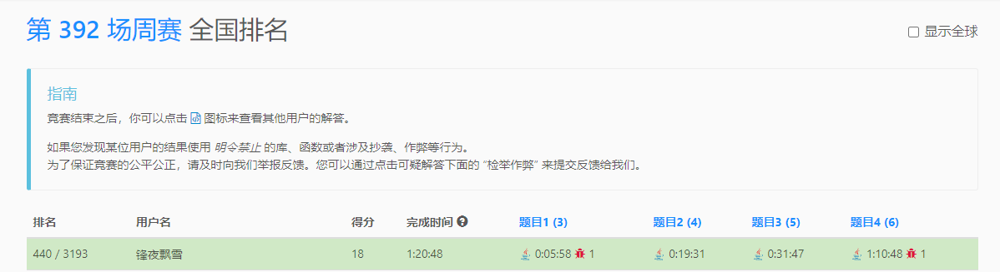

# [contest392](https://leetcode.cn/contest/weekly-contest-392/ranking/)

## t1

```java
class Solution {
    public int longestMonotonicSubarray(int[] nums) {
        int max = 0;
        int cnt = 0;
        int pre = -1;
        for (int i = 0; i < nums.length; i++) {
            if (nums[i] > pre) {
                cnt++;
                max = Math.max(max, cnt);
            } else {
                cnt = 1;
            }
            pre = nums[i];
        }
        
        pre = 100;
        cnt = 0;
        for (int i = 0; i < nums.length; i++) {
            if (nums[i] < pre) {
                cnt++;
                max = Math.max(max, cnt);
            } else {
                cnt = 1;
            }
            pre = nums[i];
        }
        return max;
    }
}

```


## t2

```java
class Solution {
    public String getSmallestString(String s, int k) {
        char[] chs = s.toCharArray();
        int nexta = 'z' - 'a' + 1;
        for (int i = 0; i < chs.length && k > 0; i++) {
            int now = chs[i] - 'a';
            if (now == 0) continue;
            int diffa2 = nexta - now;
            int min = Math.min(diffa2, now);
            if (min <= k) {
                k -= min;
                chs[i] = 'a';
            } else {
                // 距离都超过的话就不能直接变成a，那么next会变大，就只能往前移
                now -= k;
                chs[i] = (char)( 'a' + now);
                k = 0;
            }
        }
        return new String(chs);
    }
}

```

## t3

```java
class Solution {
    public long minOperationsToMakeMedianK(int[] nums, int k) {
        Arrays.sort(nums);
        int len = nums.length;
        int ind = len / 2;
        long ans = 0L + Math.abs(nums[ind] - k);
        int leftInd = ind - 1;
        int rightInd = ind + 1;

        while (leftInd >= 0 && nums[leftInd] > k) {
            ans += nums[leftInd--] - k;
        }
        while (rightInd < len && nums[rightInd] < k) {
            ans += k - nums[rightInd++];
        }

        return ans;
    }
}


```

## t4
```java
class Solution {
    public int[] minimumCost(int n, int[][] edges, int[][] query) {
        // 可以访问多次那么我就可以访问全部相邻节点，因为是& 所以访问后必定是减小或者不变的。
        // 因此对节点划分连通图，图内看全部节点的&结果，不在一个图直接返回-1
        // 并查集
        List<int[]>[] path = new LinkedList[n];
        Arrays.setAll(path, e -> new LinkedList());
        for (int i = 0; i < edges.length; i++) {
            path[edges[i][0]].add(edges[i]);
            path[edges[i][1]].add(edges[i]);
        }

        int[] parent = new int[n];
        Map<Integer, Integer> valMap = new HashMap();
        Arrays.fill(parent, -1);
        int now = 0;
        for (int i = 0; i < n; i++) {
            if (parent[i] >= 0) continue;
            int val = bfs(parent, i, path, now);
            valMap.put(now++, val);
        }

        int[] ans = new int[query.length];
        for (int i = 0; i < query.length; i++) {
            int n0 = query[i][0];
            int n1 = query[i][1];
            if (n0 == n1) {
                ans[i] = 0;
                continue;
            }
            ans[i] = parent[n0] != parent[n1] ? -1 : valMap.get(parent[n0]);
        }
        return ans;
    }

    private int bfs(int[] parent, int ind, List<int[]>[] path, int parentNo) {
        List<Integer> list = new LinkedList();
        List<Integer> nextList;
        list.add(ind);
        parent[ind] = parentNo;
        int val = Integer.MAX_VALUE;
        while (!list.isEmpty()) {
            nextList = new LinkedList();
            for (Integer now : list) {
                for (int[] next : path[now]) {
                    int n0 = next[0];
                    int n1 = next[1];
                    int n2 = next[2];
                    if (parent[n0] < 0) {
                        parent[n0] = parentNo;
                        nextList.add(n0);
                    }
                    if (parent[n1] < 0) {
                        parent[n1] = parentNo;
                        nextList.add(n1);
                    }
                    val &= n2;
                }
            }
            list = nextList;
        }
        return val;
    }
}
```