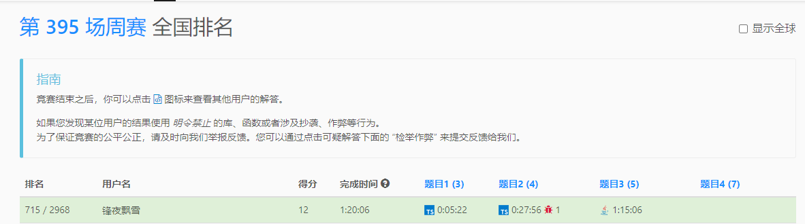

# [contest395](https://leetcode.cn/contest/weekly-contest-395/ranking/)

## t1

```typeScript
function addedInteger(nums1: number[], nums2: number[]): number {
    nums1.sort((a, b) => Number(a) - Number(b));
    nums2.sort((a, b) => Number(a) - Number(b));
    return nums2[0] - nums1[0];
};

```


## t2

```typeScript
function minimumAddedInteger(nums1: number[], nums2: number[]): number {
    nums1.sort((a, b) => Number(a) - Number(b));
    nums2.sort((a, b) => Number(a) - Number(b));
    let min = 1005;
    for (let i = nums1.length - 1; i >= nums1.length - 3; i--) {
        let x = nums2[nums2.length - 1] - nums1[i];
        if (check(nums1, nums2, x)) {
            min = x;
            break
        }
    }
    return min;
};

function check(nums1: number[], nums2: number[], x: number): boolean {
    let cnt = 0;
    let ind1 = 0;
    let ind2 = 0;
    while (ind1 < nums1.length && ind2 < nums2.length) {
        if (nums1[ind1] + x == nums2[ind2]) {
            ind1++;
            ind2++;
        } else {
            ind1++;
            cnt++;
        }
    }
    return ind2 == nums2.length;
}

```

## t3

```java
class Solution {
    // 按位 & = x 那就是 第一个为x,且x为后面所有数字的子集
    // 把x转换成二进制数组，然后n也转换成二进制数组，n-- 是因为本身就是一个此时什么都不变。
    // 然后把x中的0替换成对应n-- 位置中的数字。  n是代表第n大的数字，我们只需要在x的基础上把0的位置改成对应n中的就是找到匹配的数字了
    public long minEnd(int n, int x) {
        int[] digits = new int[100];
        int[] digitsN = new int[100];
        int ind = 0;
        while (x > 0) {
            digits[ind++] = x & 1;
            x /= 2;
        }
        n--;
        ind = 0;
        while (n > 0) {
            digitsN[ind++] = n & 1;
            n /= 2;
        }
        ind = 0;
        long ans = 0L;
        long base = 1L;
        for (int i = 0; i < digits.length; i++) {
            if (digits[i] == 0) {
                digits[i] = digitsN[ind++];
            }
            ans += digits[i] == 1 ? base : 0L;
            base <<= 1;
        }
        return ans;
    }
}


```

## t4
```java

```