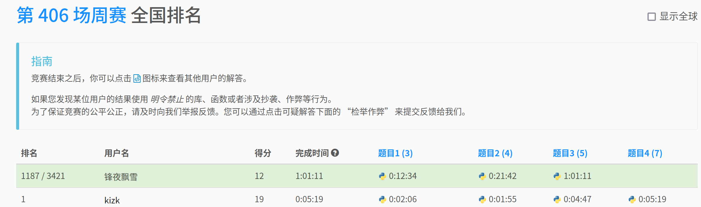

# [contest406](https://leetcode.cn/contest/weekly-contest-406/ranking/)

## t1

```python
class Solution:
    def getSmallestString(self, s: str) -> str:
        for i in range(1, len(s)):
            a, b = int(s[i - 1]), int(s[i])
            if  a > b and a % 2 == b % 2:
                return s[0: i - 1] + str(b) + str(a) + s[i + 1:]
            
        return s
```


## t2

```python
# Definition for singly-linked list.
# class ListNode:
#     def __init__(self, val=0, next=None):
#         self.val = val
#         self.next = next
class Solution:
    def modifiedList(self, nums: List[int], head: Optional[ListNode]) -> Optional[ListNode]:
        root = ListNode()
        ns = set(nums)
        root.next = head
        pre = root
        while pre != None:
            nexts = pre.next
            while nexts != None and nexts.val in ns:
                nexts = nexts.next
                # print("nexts:", nexts)
            pre.next = nexts
            pre = nexts
            # print("pre:", pre)
        return root.next
                
```

## t3

```python
class Solution:
    def minimumCost(self, m: int, n: int, horizontalCut: List[int], verticalCut: List[int]) -> int:
        # topleft topright bottomleft bottomright
        # x x1 y y1
        @cache
        def dfs(x: int, x1: int, y:int, y1: int) -> int:
            if x + 1 >= x1 and y + 1 >= y1:
                return 0
            cost = inf
            # 竖着切
            for i in range(x + 1, x1):
                #[(x, y), (i, y1)] [(i, y), (x1, y1)]
                cost = min(cost, dfs(x, i, y, y1) + dfs(i, x1, y, y1) + verticalCut[i - 1])
            # 横着切
            for j in range(y + 1, y1):
                #[(x, y), (x1, j)] [(x, j), (x1, y1)]
                cost = min(cost, dfs(x, x1, y, j) + dfs(x, x1, j, y1) + horizontalCut[j - 1])
            return cost
        return dfs(0, n, 0, m)
                

```

## t4
```python


```